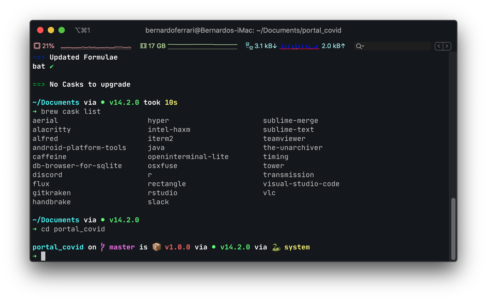

# Bernardo's current setup

Inspired by "[What terminal is Felix using](https://github.com/KrauseFx/what-terminal-is-felix-using)" and "[What dotfiles is Felix using](https://github.com/KrauseFx/dotfiles)", I decided to share my own files and setup. His project allowed me to start having fun with the terminal, so this is kind of a fork.

- I use [iTerm2](https://www.iterm2.com/).
- I use [oh-my-zshell](https://github.com/robbyrussell/oh-my-zsh).
- I used to use [Meslo Powerline Font](https://github.com/powerline/fonts/blob/master/Meslo%20Slashed/Meslo%20LG%20M%20Regular%20for%20Powerline.ttf), but currently I am using [JetBrains Mono](https://github.com/JetBrains/JetBrainsMono).
- I use [VSCode](https://code.visualstudio.com/) as my default text editor.
- I love [bat](https://github.com/sharkdp/bat) instead of the default cat.
- I try to install every app or script using [Homebrew](https://brew.sh/) and [HomeBrew Cask](https://github.com/Homebrew/homebrew-cask).

By using HomeBrew to take care of most stuff, updates are easy and painless. Besides this, by sharing these files, I allow anyone (including myself, in the future) to just grab them and have the same experience as me today. This would have never been possible with the App Store, which is completely broken in Catalina.

#### TODO:

- I would like an easy way to deal with file extensions (open with..). Some apps, like Xcode, set the default for itself for many many formats. It is too boring to manually configure every possible file extension to open VSCode instead of anything else.
